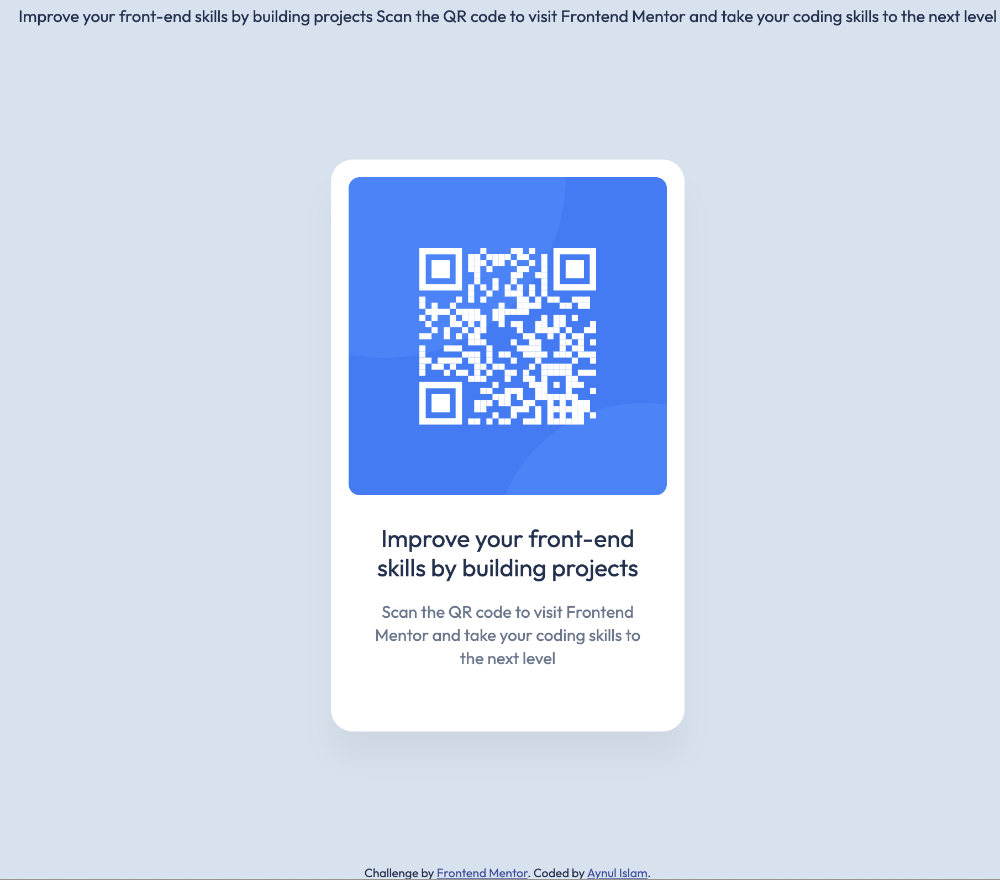

# Frontend Mentor - QR code component solution

This is a solution to the [QR code component challenge on Frontend Mentor](https://www.frontendmentor.io/challenges/qr-code-component-iux_sIO_H). Frontend Mentor challenges help you improve your coding skills by building realistic projects. 

## Table of contents

- [Overview](#overview)
  - [Screenshot](#screenshot)
  - [Links](#links)
- [My process](#my-process)
  - [Built with](#built-with)
  - [What I learned](#what-i-learned)
  - [Continued development](#continued-development)
  - [Useful resources](#useful-resources)
- [Author](#author)
- [Acknowledgments](#acknowledgments)

## Overview
This project is a HTML and CSS based project of making Card. Cards are image on the top followed by some text in a rectangular area. In this project QR code is used as card-image.

### Screenshot

### Links

- Solution URL: [Github Page](https://github.com/nayan041/QR_Code-FrontendMentor.git)
- Live Site URL: [Frontend Mentor’s QR-code project website](https://nayan041.github.io/QR_Code-FrontendMentor/)

## My process

### Built with

- Semantic HTML5 markup
- CSS custom properties
- Flexbox
- Desktop-first workflow

### What I learned

Spacing is very much complicated to me. It is important to maintain proper spacing using CSS. Card text warping is not working for me using flex box wrap property. Then line break ` ` are found helpful to slice down the text content into pieces.

Figma design related guide and Git related learning is very much helpful. Thanks to **Frontend Mentor** for written guidance.

### Continued development

CSS proper spacing and HTML nested structure limiting techniques.

### Useful resources

- [Jonas’ Course on Udemy regarding  HTML and CSS](https://www.udemy.com/course/design-and-develop-a-killer-website-with-html5-and-css3/?couponCode=ST22MT92324A) - This website helped me for growing confidence on Card building.

## Author
- Frontend Mentor - [@nayan041](https://www.frontendmentor.io/profile/nayan041)

## Acknowledgments
- Frontend Mentor.

